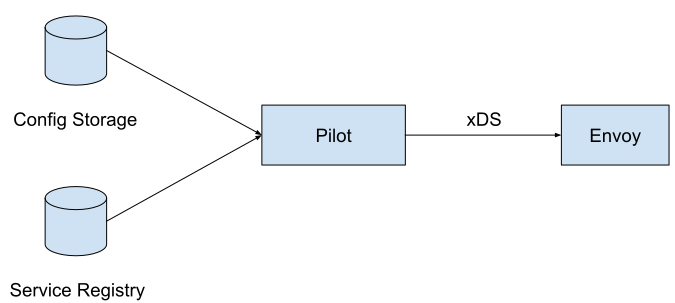
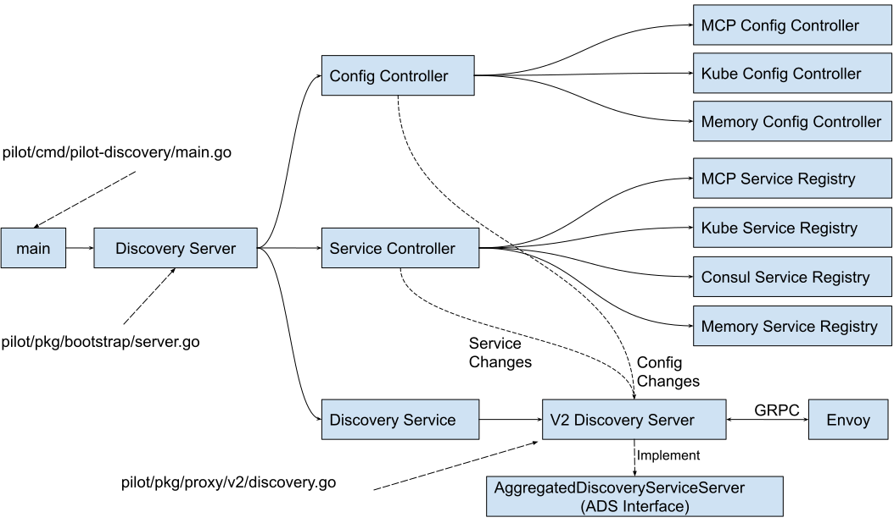
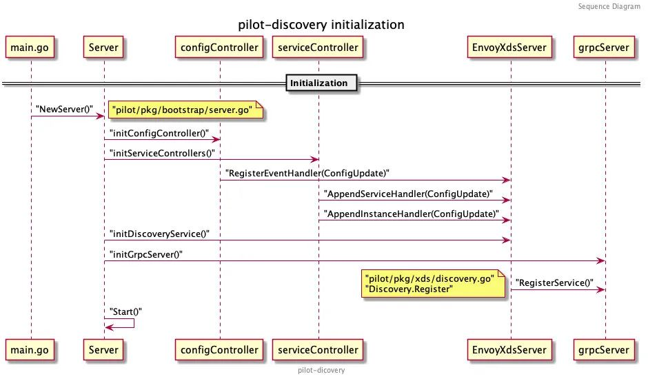

# pilot_discover分析

Istio 控制面组件 pilot-discovery 主要接受两类输入数据，然后按照一定逻辑输出一类数据。


输入数据
- config：istio 中的一些配置，比如虚拟服务，目标规则等规则。由 configcontroller 处理。
- service：相当于注册中心，存放了服务和实例，由 servciecontroller 处理。

输出数据
- xds: 生成envoy配置，下发给Proxy。由xds server处理。

源码中，Server为pilot-discovery的主服务，对应包含了三个重要组件：
- Config Controller：从不同来源接收流量控制和路由规则等 Istio 的配置，并响应各类事件。
- Service Controller：从不同注册中心同步服务及实例，并响应各类事件。
- EnvoyXdsServer：核心的xDS协议推送服务，根据上面组件的数据生成 xDS 协议并下发。

Pilot-Discovery的入口函数为：pilot/cmd/pilot-discovery/main.go中的main方法。main方法中创建了Discovery Server


- Config Controller。用于管理各种配置数据，包括用户创建的流量管理规则和策略。
  比较核心的就是对接 Kubernetes，从 kube-apiserver 中 Watch 集群中的 VirtualService、ServiceEntry、DestinationRules 等配置信息，有变化则生成 PushRequest 推送至 EnvoyXdsServer 中的推送队列。除此之外，还支持对接 MCP(Mesh Configuration Protocol) 协议的 gRPC Server，如 Nacos 的 MCP 服务等，只需要在 meshconfig 中配置 configSources 即可。最后一种是基于内存的 Config Controller 实现，通过 Watch 一个文件目录，加载目录中的 yaml 文件生成配置数据，主要用来测试。
  
  Istio目前支持三种类型的Config Controller：
  - Kubernetes：使用Kubernetes来作为配置数据的存储，该方式直接依附于Kubernetes强大的CRD机制来存储配置数据，简单方便，是Istio最开始使用的配置存储方案。
  - MCP (Mesh Configuration Protocol)：使用Kubernetes来存储配置数据导致了Istio和Kubernetes的耦合，限制了Istio在非Kubernetes环境下的运用。为了解决该耦合，Istio社区提出了MCP，MCP定义了一个向Istio控制面下发配置数据的标准协议，Istio Pilot作为MCP Client，任何实现了MCP协议的Server都可以通过MCP协议向Pilot下发配置，从而解除了Istio和Kubernetes的耦合。
  - Memory：一个在内存中的Config Controller实现，主要用于测试.

  目前Istio的配置包括：
  - Virtual Service: 定义流量路由规则。
  - Destination Rule: 定义和一个服务或者subset相关的流量处理规则，包括负载均衡策略，连接池大小，断路器设置，subset定义等等。
  - Gateway: 定义入口网关上对外暴露的服务。
  - Service Entry: 通过定义一个Service Entry可以将一个外部服务手动添加到服务网格中。
  - Envoy Filter: 通过Pilot在Envoy的配置中添加一个自定义的Filter。

- Service Controller。用于管理各种Service Registry，提出服务发现数据。

目前原生支持Kubernetes和Consul，注册在这些注册中心中的服务可以无缝接入Mesh，另外一种比较特殊，就是ServiceEntryStore，它本质是储存在Config Controller中的Istio配置数据，但它描述的却是集群外部的服务信息。Istio 通过它将集群外部，如部署在虚拟机中的服务、非 Kubernetes 的原生服务同步到 Istio 中，纳入网格统一进行流量控制和路由，所以 ServiceEntryStore 也可以视为一种注册中心。还有一种就是 Mock Service Registry，主要用来测试。

  目前Istio支持的Service Registry包括：
  - Kubernetes：对接Kubernetes Registry，可以将Kubernetes中定义的Service和Instance采集到Istio中。
  - Consul： 对接Consul Catalog，将Consul中定义的Service采集到Istio中。
  - MCP： 和MCP config controller类似，从MCP Server中获取Service和Service Instance。
  - Memory： 一个内存中的Service Controller实现，主要用于测试。
 
- Discovery Service中主要包含下述逻辑：

启动gRPC Server并接收来自Envoy端的连接请求。
接收Envoy端的xDS请求，从Config Controller和Service Controller中获取配置和服务信息，生成响应消息发送给Envoy。
监听来自Config Controller的配置变化消息和来自Service Controller的服务变化消息，并将配置和服务变化内容通过xDS接口推送到Envoy。
（备注：目前Pilot未实现增量变化推送，每次变化推送的是全量配置，在网格中服务较多的情况下可能会有性能问题）。

## 主程序
```diff
func main() {
	log.EnableKlogWithCobra()
	rootCmd := app.NewRootCommand()
	if err := rootCmd.Execute(); err != nil {
		log.Error(err)
		os.Exit(-1)
	}
}
```
- rootCmd命令
```diff
// NewRootCommand returns the root cobra command of pilot-discovery.
func NewRootCommand() *cobra.Command {
	rootCmd := &cobra.Command{
		Use:          "pilot-discovery",
		Short:        "Istio Pilot.",
		Long:         "Istio Pilot provides fleet-wide traffic management capabilities in the Istio Service Mesh.",
		SilenceUsage: true,
		PreRunE: func(c *cobra.Command, args []string) error {
			cmd.AddFlags(c)
			return nil
		},
	}

	discoveryCmd := newDiscoveryCommand()
	addFlags(discoveryCmd)
	rootCmd.AddCommand(discoveryCmd)
	rootCmd.AddCommand(version.CobraCommand())
	rootCmd.AddCommand(collateral.CobraCommand(rootCmd, &doc.GenManHeader{
		Title:   "Istio Pilot Discovery",
		Section: "pilot-discovery CLI",
		Manual:  "Istio Pilot Discovery",
	}))
	rootCmd.AddCommand(requestCmd)

	return rootCmd
}

func newDiscoveryCommand() *cobra.Command {
	return &cobra.Command{
		Use:   "discovery",
		Short: "Start Istio proxy discovery service.",
		Args:  cobra.ExactArgs(0),
		PreRunE: func(c *cobra.Command, args []string) error {
			log.Configure(loggingOptions)
			validateFlags(serverArgs)
			serverArgs.Complete()
			return nil
		},
		RunE: func(c *cobra.Command, args []string) error {
			cmd.PrintFlags(c.Flags())

			// Create the stop channel for all of the servers.
			stop := make(chan struct{})

			// Create the server for the discovery service.
			discoveryServer, err := bootstrap.NewServer(serverArgs)

			// Start the server
			discoveryServer.Start(stop); err != nil {

			cmd.WaitSignal(stop)
			// Wait until we shut down. In theory this could block forever; in practice we will get
			// forcibly shut down after 30s in Kubernetes.
			discoveryServer.WaitUntilCompletion()
			return nil
		},
	}
}
```

## Discover 命令
```diff
		RunE: func(c *cobra.Command, args []string) error {
			cmd.PrintFlags(c.Flags())

			// Create the stop channel for all of the servers.
			stop := make(chan struct{})

			// Create the server for the discovery service.
			discoveryServer, err := bootstrap.NewServer(serverArgs)

			// Start the server
			discoveryServer.Start(stop); err != nil {

			cmd.WaitSignal(stop)
			// Wait until we shut down. In theory this could block forever; in practice we will get
			// forcibly shut down after 30s in Kubernetes.
			discoveryServer.WaitUntilCompletion()
			return nil
		},
```

- bootstrap.NewServer初始化



```diff
type Server struct {
  XDSServer *xds.DiscoveryServer  // Xds 服务
  environment *model.Environment  // Pilot 环境所需的 API 集合
  kubeClient kubelib.Client // kube的几种clients: restclient,clientset,dynamicclient,discoverclient
  kubeRegistry *kubecontroller.Controller   // 处理 Kubernetes 主集群的注册中心
  multicluster *kubecontroller.Multicluster // 处理 Kubernetes 多个集群的注册中心
  configController  model.ConfigStoreCache  // 统一处理配置数据（如 VirtualService 等) 的 Controller
  ConfigStores      []model.ConfigStoreCache // 不同配置信息的缓存器，提供 Get、List、Create 等方法
  serviceEntryStore *serviceentry.ServiceEntryStore // 单独处理 ServiceEntry 的 Controller
  fileWatcher filewatcher.FileWatcher // 文件监听器，主要 watch meshconfig 和 networks 配置文件等
  startFuncs []startFunc // 保存了上述所有服务的启动函数，便于在 Start() 方法中批量启动及管理
...
}

// NewServer creates a new Server instance based on the provided arguments.
func NewServer(args *PilotArgs, initFuncs ...func(*Server)) (*Server, error) {
	e := &model.Environment{
		PushContext:  model.NewPushContext(),
		DomainSuffix: args.RegistryOptions.KubeOptions.DomainSuffix,
	}
	e.SetLedger(buildLedger(args.RegistryOptions))

	ac := aggregate.NewController(aggregate.Options{
		MeshHolder: e,
	})
	e.ServiceDiscovery = ac

	s := &Server{
		clusterID:               getClusterID(args),
		environment:             e,
		fileWatcher:             filewatcher.NewWatcher(),
		httpMux:                 http.NewServeMux(),
		monitoringMux:           http.NewServeMux(),
		readinessProbes:         make(map[string]readinessProbe),
		workloadTrustBundle:     tb.NewTrustBundle(nil),
		server:                  server.New(),
		shutdownDuration:        args.ShutdownDuration,
		internalStop:            make(chan struct{}),
		istiodCertBundleWatcher: keycertbundle.NewWatcher(),
	}
	// Apply custom initialization functions.
	for _, fn := range initFuncs {
		fn(s)
	}
	// Initialize workload Trust Bundle before XDS Server
	e.TrustBundle = s.workloadTrustBundle
+	// 创建DiscoverServer，xDS的gRPC下发服务	
	s.XDSServer = xds.NewDiscoveryServer(e, args.Plugins, args.PodName, args.Namespace, args.RegistryOptions.KubeOptions.ClusterAliases)

	prometheus.EnableHandlingTimeHistogram()

	// Apply the arguments to the configuration.
	if err := s.initKubeClient(args); err != nil {
		return nil, fmt.Errorf("error initializing kube client: %v", err)
	}

	// used for both initKubeRegistry and initClusterRegistries
	args.RegistryOptions.KubeOptions.EndpointMode = kubecontroller.DetectEndpointMode(s.kubeClient)

+	// initMeshConfiguration和initMeshNetworks是通过fileWatcher对istiod从configmap中
+	// 挂载的两个配置文件mesh和meshNetworks进行监听。当配置文件发生变化时重载配置并触发相应的Handlers 
	s.initMeshConfiguration(args, s.fileWatcher)
	spiffe.SetTrustDomain(s.environment.Mesh().GetTrustDomain())

	s.initMeshNetworks(args, s.fileWatcher)
+	// initMeshHandlers为上述两个配置文件注册了两个Handler，当配置文件发生变化时触发全量xDS下发	
	s.initMeshHandlers()
	s.environment.Init()

	// Options based on the current 'defaults' in istio.
	caOpts := &caOptions{
		TrustDomain:      s.environment.Mesh().TrustDomain,
		Namespace:        args.Namespace,
		ExternalCAType:   ra.CaExternalType(externalCaType),
		CertSignerDomain: features.CertSignerDomain,
	}

	if caOpts.ExternalCAType == ra.ExtCAK8s {
		// Older environment variable preserved for backward compatibility
		caOpts.ExternalCASigner = k8sSigner
	}
	// CA signing certificate must be created first if needed.
	if err := s.maybeCreateCA(caOpts); err != nil {
		return nil, err
	}

+	// 初始化了三种控制器分别处理证书、配置信息和注册信息，证书及安全相关的内容
	if err := s.initControllers(args); err != nil {
		return nil, err
	}

	s.XDSServer.InitGenerators(e, args.Namespace)

	// Initialize workloadTrustBundle after CA has been initialized
	if err := s.initWorkloadTrustBundle(args); err != nil {
		return nil, err
	}

	// Parse and validate Istiod Address.
	istiodHost, _, err := e.GetDiscoveryAddress()
	if err != nil {
		return nil, err
	}

	// Create Istiod certs and setup watches.
	if err := s.initIstiodCerts(args, string(istiodHost)); err != nil {
		return nil, err
	}

	// Secure gRPC Server must be initialized after CA is created as may use a Citadel generated cert.
	if err := s.initSecureDiscoveryService(args); err != nil {
		return nil, fmt.Errorf("error initializing secure gRPC Listener: %v", err)
	}

	var wh *inject.Webhook
	// common https server for webhooks (e.g. injection, validation)
	if s.kubeClient != nil {
		s.initSecureWebhookServer(args)
		wh, err = s.initSidecarInjector(args)
		if err != nil {
			return nil, fmt.Errorf("error initializing sidecar injector: %v", err)
		}
		if err := s.initConfigValidation(args); err != nil {
			return nil, fmt.Errorf("error initializing config validator: %v", err)
		}
	}

	whc := func() map[string]string {
		if wh != nil {
			return wh.Config.Templates
		}
		return map[string]string{}
	}

	// Used for readiness, monitoring and debug handlers.
	if err := s.initIstiodAdminServer(args, whc); err != nil {
		return nil, fmt.Errorf("error initializing debug server: %v", err)
	}
	// This should be called only after controllers are initialized.
	s.initRegistryEventHandlers()

	s.initDiscoveryService(args)

	s.initSDSServer()

	// Notice that the order of authenticators matters, since at runtime
	// authenticators are activated sequentially and the first successful attempt
	// is used as the authentication result.
	authenticators := []security.Authenticator{
		&authenticate.ClientCertAuthenticator{},
	}
	if args.JwtRule != "" {
		jwtAuthn, err := initOIDC(args, s.environment.Mesh().TrustDomain)
		if err != nil {
			return nil, fmt.Errorf("error initializing OIDC: %v", err)
		}
		if jwtAuthn == nil {
			return nil, fmt.Errorf("JWT authenticator is nil")
		}
		authenticators = append(authenticators, jwtAuthn)
	}
	// The k8s JWT authenticator requires the multicluster registry to be initialized,
	// so we build it later.
	authenticators = append(authenticators,
		kubeauth.NewKubeJWTAuthenticator(s.environment.Watcher, s.kubeClient, s.clusterID, s.multiclusterController.GetRemoteKubeClient, features.JwtPolicy))
	if features.XDSAuth {
		s.XDSServer.Authenticators = authenticators
	}
	caOpts.Authenticators = authenticators

	// Start CA or RA server. This should be called after CA and Istiod certs have been created.
	s.startCA(caOpts)

	// TODO: don't run this if galley is started, one ctlz is enough
	if args.CtrlZOptions != nil {
		_, _ = ctrlz.Run(args.CtrlZOptions, nil)
	}

	// This must be last, otherwise we will not know which informers to register
	if s.kubeClient != nil {
		s.addStartFunc(func(stop <-chan struct{}) error {
			s.kubeClient.RunAndWait(stop)
			return nil
		})
	}

	s.addReadinessProbe("discovery", func() (bool, error) {
		return s.XDSServer.IsServerReady(), nil
	})

	return s, nil
}
```

Environment

```diff
// Environment provides an aggregate environmental API for Pilot
type Environment struct {
	// Discovery interface for listing services and instances.
	ServiceDiscovery

	// Config interface for listing routing rules
	IstioConfigStore

	// Watcher is the watcher for the mesh config (to be merged into the config store)
	mesh.Watcher

	// NetworksWatcher (loaded from a config map) provides information about the
	// set of networks inside a mesh and how to route to endpoints in each
	// network. Each network provides information about the endpoints in a
	// routable L3 network. A single routable L3 network can have one or more
	// service registries.
	mesh.NetworksWatcher

	NetworkManager *NetworkManager

	// PushContext holds information during push generation. It is reset on config change, at the beginning
	// of the pushAll. It will hold all errors and stats and possibly caches needed during the entire cache computation.
	// DO NOT USE EXCEPT FOR TESTS AND HANDLING OF NEW CONNECTIONS.
	// ALL USE DURING A PUSH SHOULD USE THE ONE CREATED AT THE
	// START OF THE PUSH, THE GLOBAL ONE MAY CHANGE AND REFLECT A DIFFERENT
	// CONFIG AND PUSH
	PushContext *PushContext

	// DomainSuffix provides a default domain for the Istio server.
	DomainSuffix string

	ledger ledger.Ledger

	// TrustBundle: List of Mesh TrustAnchors
	TrustBundle *trustbundle.TrustBundle

	clusterLocalServices ClusterLocalProvider

	GatewayAPIController GatewayController
}

// ServiceDiscovery enumerates Istio service instances.
// nolint: lll
type ServiceDiscovery interface {
	NetworkGatewaysWatcher

	// Services list declarations of all services in the system
	Services() ([]*Service, error)

	// GetService retrieves a service by host name if it exists
	GetService(hostname host.Name) *Service

	// InstancesByPort retrieves instances for a service on the given ports with labels that match
	// any of the supplied labels. All instances match an empty tag list.
	//
	// For example, consider an example of catalog.mystore.com:
	// Instances(catalog.myservice.com, 80) ->
	//      --> IstioEndpoint(172.16.0.1:8888), Service(catalog.myservice.com), Labels(foo=bar)
	//      --> IstioEndpoint(172.16.0.2:8888), Service(catalog.myservice.com), Labels(foo=bar)
	//      --> IstioEndpoint(172.16.0.3:8888), Service(catalog.myservice.com), Labels(kitty=cat)
	//      --> IstioEndpoint(172.16.0.4:8888), Service(catalog.myservice.com), Labels(kitty=cat)
	//
	// Calling Instances with specific labels returns a trimmed list.
	// e.g., Instances(catalog.myservice.com, 80, foo=bar) ->
	//      --> IstioEndpoint(172.16.0.1:8888), Service(catalog.myservice.com), Labels(foo=bar)
	//      --> IstioEndpoint(172.16.0.2:8888), Service(catalog.myservice.com), Labels(foo=bar)
	//
	// Similar concepts apply for calling this function with a specific
	// port, hostname and labels.
	//
	// Introduced in Istio 0.8. It is only called with 1 port.
	// CDS (clusters.go) calls it for building 'dnslb' type clusters.
	// EDS calls it for building the endpoints result.
	// Consult istio-dev before using this for anything else (except debugging/tools)
	InstancesByPort(svc *Service, servicePort int, labels labels.Collection) []*ServiceInstance

	// GetProxyServiceInstances returns the service instances that co-located with a given Proxy
	//
	// Co-located generally means running in the same network namespace and security context.
	//
	// A Proxy operating as a Sidecar will return a non-empty slice.  A stand-alone Proxy
	// will return an empty slice.
	//
	// There are two reasons why this returns multiple ServiceInstances instead of one:
	// - A ServiceInstance has a single IstioEndpoint which has a single Port.  But a Service
	//   may have many ports.  So a workload implementing such a Service would need
	//   multiple ServiceInstances, one for each port.
	// - A single workload may implement multiple logical Services.
	//
	// In the second case, multiple services may be implemented by the same physical port number,
	// though with a different ServicePort and IstioEndpoint for each.  If any of these overlapping
	// services are not HTTP or H2-based, behavior is undefined, since the listener may not be able to
	// determine the intended destination of a connection without a Host header on the request.
	GetProxyServiceInstances(*Proxy) []*ServiceInstance

	GetProxyWorkloadLabels(*Proxy) labels.Collection

	// GetIstioServiceAccounts returns a list of service accounts looked up from
	// the specified service hostname and ports.
	// Deprecated - service account tracking moved to XdsServer, incremental.
	GetIstioServiceAccounts(svc *Service, ports []int) []string

	// MCSServices returns information about the services that have been exported/imported via the
	// Kubernetes Multi-Cluster Services (MCS) ServiceExport API. Only applies to services in
	// Kubernetes clusters.
	MCSServices() []MCSServiceInfo
}

+ // IstioConfigStore是支持存取Istio配置信息的接口
// IstioConfigStore is a specialized interface to access config store using
// Istio configuration types
type IstioConfigStore interface {
	ConfigStore

	// ServiceEntries lists all service entries
	ServiceEntries() []config.Config

	// Gateways lists all gateways bound to the specified workload labels
	Gateways(workloadLabels labels.Collection) []config.Config

	// AuthorizationPolicies selects AuthorizationPolicies in the specified namespace.
	AuthorizationPolicies(namespace string) []config.Config
}

+ // ConfigStore是一套平台无关的APIs，用来支持存取配置信息
// ConfigStore describes a set of platform agnostic APIs that must be supported
// by the underlying platform to store and retrieve Istio configuration.
//
// Configuration key is defined to be a combination of the type, name, and
// namespace of the configuration object. The configuration key is guaranteed
// to be unique in the store.
//
// The storage interface presented here assumes that the underlying storage
// layer supports _Get_ (list), _Update_ (update), _Create_ (create) and
// _Delete_ semantics but does not guarantee any transactional semantics.
//
// _Update_, _Create_, and _Delete_ are mutator operations. These operations
// are asynchronous, and you might not see the effect immediately (e.g. _Get_
// might not return the object by key immediately after you mutate the store.)
// Intermittent errors might occur even though the operation succeeds, so you
// should always check if the object store has been modified even if the
// mutating operation returns an error.  Objects should be created with
// _Create_ operation and updated with _Update_ operation.
//
// Resource versions record the last mutation operation on each object. If a
// mutation is applied to a different revision of an object than what the
// underlying storage expects as defined by pure equality, the operation is
// blocked.  The client of this interface should not make assumptions about the
// structure or ordering of the revision identifier.
//
// Object references supplied and returned from this interface should be
// treated as read-only. Modifying them violates thread-safety.
type ConfigStore interface {
	// Schemas exposes the configuration type schema known by the config store.
	// The type schema defines the bidirectional mapping between configuration
	// types and the protobuf encoding schema.
	Schemas() collection.Schemas

	// Get retrieves a configuration element by a type and a key
	Get(typ config.GroupVersionKind, name, namespace string) *config.Config

	// List returns objects by type and namespace.
	// Use "" for the namespace to list across namespaces.
	List(typ config.GroupVersionKind, namespace string) ([]config.Config, error)

	// Create adds a new configuration object to the store. If an object with the
	// same name and namespace for the type already exists, the operation fails
	// with no side effects.
	Create(config config.Config) (revision string, err error)

	// Update modifies an existing configuration object in the store.  Update
	// requires that the object has been created.  Resource version prevents
	// overriding a value that has been changed between prior _Get_ and _Put_
	// operation to achieve optimistic concurrency. This method returns a new
	// revision if the operation succeeds.
	Update(config config.Config) (newRevision string, err error)

	UpdateStatus(config config.Config) (newRevision string, err error)

	// Patch applies only the modifications made in the PatchFunc rather than doing a full replace. Useful to avoid
	// read-modify-write conflicts when there are many concurrent-writers to the same resource.
	Patch(orig config.Config, patchFn config.PatchFunc) (string, error)

	// Delete removes an object from the store by key
	// For k8s, resourceVersion must be fulfilled before a deletion is carried out.
	// If not possible, a 409 Conflict status will be returned.
	Delete(typ config.GroupVersionKind, name, namespace string, resourceVersion *string) error
}
```

 mesh.Watcher和mesh.NetworksWatcher负责监听istiod启动时挂载的两个配置文件，这两个配置文件是通过configmap映射到Pod的文件系统中的，监听器将在监听到配置文件变化时运行预先注册的Handler。
 

 ```diff
 + // 文件挂载参考istiod的配置文件
 apiVersion: v1
kind: Pod
metadata:
  name: istiod-56c488887d-z9k5c
  namespace: istio-system
spec:
  containers:
    volumeMounts:
    - mountPath: /etc/istio/config
      name: config-volume
  volumes:
  - configMap:
      defaultMode: 420
      name: istio
    name: config-volume
```

```diff
+ // 配置存储在istio-system/istio这个configmap中，里面保存了mesh和meshNetworks两种配置
apiVersion: v1
kind: ConfigMap
metadata:
  name: istio
  namespace: istio-system
data:
  mesh: |-
    accessLogEncoding: TEXT
    accessLogFile: ""
    accessLogFormat: ""
    defaultConfig:
      binaryPath: /usr/local/bin/mosn
      concurrency: 2
      configPath: ./etc/istio/proxy
    ...
  meshNetworks: 'networks: {}'
  ```
- s.XDSServer = xds.NewDiscoveryServer(...)

该服务为Envoy xDS APIs的gRPC实现
```diff
// NewDiscoveryServer creates DiscoveryServer that sources data from Pilot's internal mesh data structures
func NewDiscoveryServer(env *model.Environment, plugins []string, instanceID string, systemNameSpace string,
	clusterAliases map[string]string) *DiscoveryServer {
	out := &DiscoveryServer{
		Env:                     env,
		Generators:              map[string]model.XdsResourceGenerator{},
		ProxyNeedsPush:          DefaultProxyNeedsPush,
		EndpointShardsByService: map[string]map[string]*EndpointShards{},
		concurrentPushLimit:     make(chan struct{}, features.PushThrottle),
		requestRateLimit:        rate.NewLimiter(rate.Limit(features.RequestLimit), 1),
		InboundUpdates:          atomic.NewInt64(0),
		CommittedUpdates:        atomic.NewInt64(0),
		pushChannel:             make(chan *model.PushRequest, 10),
		pushQueue:               NewPushQueue(),
		debugHandlers:           map[string]string{},
		adsClients:              map[string]*Connection{},
		debounceOptions: debounceOptions{
			debounceAfter:     features.DebounceAfter,
			debounceMax:       features.DebounceMax,
			enableEDSDebounce: features.EnableEDSDebounce,
		},
		Cache:      model.DisabledCache{},
		instanceID: instanceID,
	}

	out.ClusterAliases = make(map[cluster.ID]cluster.ID)
	for alias := range clusterAliases {
		out.ClusterAliases[cluster.ID(alias)] = cluster.ID(clusterAliases[alias])
	}

	out.initJwksResolver()

	if features.EnableXDSCaching {
		out.Cache = model.NewXdsCache()
	}

	out.ConfigGenerator = core.NewConfigGenerator(plugins, out.Cache)

	return out
}
```
- 初始化MeshConfig、 KubeClient、MeshNetworks和MeshHandlers
```diff
// initKubeClient creates the k8s client if running in an k8s environment.
// This is determined by the presence of a kube registry, which
// uses in-context k8s, or a config source of type k8s.
func (s *Server) initKubeClient(args *PilotArgs) error {
	if s.kubeClient != nil {
		// Already initialized by startup arguments
		return nil
	}
	hasK8SConfigStore := false
	if args.RegistryOptions.FileDir == "" {
		// If file dir is set - config controller will just use file.
		if _, err := os.Stat(args.MeshConfigFile); !os.IsNotExist(err) {
			meshConfig, err := mesh.ReadMeshConfig(args.MeshConfigFile)
			if err != nil {
				return fmt.Errorf("failed reading mesh config: %v", err)
			}
			if len(meshConfig.ConfigSources) == 0 && args.RegistryOptions.KubeConfig != "" {
				hasK8SConfigStore = true
			}
			for _, cs := range meshConfig.ConfigSources {
				if cs.Address == string(Kubernetes)+"://" {
					hasK8SConfigStore = true
					break
				}
			}
		} else if args.RegistryOptions.KubeConfig != "" {
			hasK8SConfigStore = true
		}
	}

	if hasK8SConfigStore || hasKubeRegistry(args.RegistryOptions.Registries) {
		// Used by validation
		kubeRestConfig, err := kubelib.DefaultRestConfig(args.RegistryOptions.KubeConfig, "", func(config *rest.Config) {
			config.QPS = args.RegistryOptions.KubeOptions.KubernetesAPIQPS
			config.Burst = args.RegistryOptions.KubeOptions.KubernetesAPIBurst
		})
		if err != nil {
			return fmt.Errorf("failed creating kube config: %v", err)
		}

		s.kubeClient, err = kubelib.NewClient(kubelib.NewClientConfigForRestConfig(kubeRestConfig))
		if err != nil {
			return fmt.Errorf("failed creating kube client: %v", err)
		}
	}

	return nil
}

// initMeshConfiguration creates the mesh in the pilotConfig from the input arguments.
// Original/default behavior:
// - use the mounted file, if it exists.
// - use istio-REVISION if k8s is enabled
// - fallback to default
//
// If the 'SHARED_MESH_CONFIG' env is set (experimental feature in 1.10):
// - if a file exist, load it - will be merged
// - if istio-REVISION exists, will be used, even if the file is present.
// - the SHARED_MESH_CONFIG config map will also be loaded and merged.
func (s *Server) initMeshConfiguration(args *PilotArgs, fileWatcher filewatcher.FileWatcher) {
	log.Info("initializing mesh configuration ", args.MeshConfigFile)
	defer func() {
		if s.environment.Watcher != nil {
			log.Infof("mesh configuration: %s", mesh.PrettyFormatOfMeshConfig(s.environment.Mesh()))
			log.Infof("version: %s", version.Info.String())
			argsdump, _ := json.MarshalIndent(args, "", "   ")
			log.Infof("flags: %s", argsdump)
		}
	}()

	// Watcher will be merging more than one mesh config source?
	multiWatch := features.SharedMeshConfig != ""

	var err error
	if _, err = os.Stat(args.MeshConfigFile); !os.IsNotExist(err) {
		s.environment.Watcher, err = mesh.NewFileWatcher(fileWatcher, args.MeshConfigFile, multiWatch)
		if err == nil {
			if multiWatch {
				kubemesh.AddUserMeshConfig(
					s.kubeClient, s.environment.Watcher, args.Namespace, configMapKey, features.SharedMeshConfig, s.internalStop)
			} else {
				// Normal install no longer uses this mode - testing and special installs still use this.
				log.Warnf("Using local mesh config file %s, in cluster configs ignored", args.MeshConfigFile)
			}
			return
		}
	}

	// Config file either didn't exist or failed to load.
	if s.kubeClient == nil {
		// Use a default mesh.
		meshConfig := mesh.DefaultMeshConfig()
		s.environment.Watcher = mesh.NewFixedWatcher(&meshConfig)
		log.Warnf("Using default mesh - missing file %s and no k8s client", args.MeshConfigFile)
		return
	}

	// Watch the istio ConfigMap for mesh config changes.
	// This may be necessary for external Istiod.
	configMapName := getMeshConfigMapName(args.Revision)
	s.environment.Watcher = kubemesh.NewConfigMapWatcher(
		s.kubeClient, args.Namespace, configMapName, configMapKey, multiWatch, s.internalStop)

	if multiWatch {
		kubemesh.AddUserMeshConfig(s.kubeClient, s.environment.Watcher, args.Namespace, configMapKey, features.SharedMeshConfig, s.internalStop)
	}
}

// initMeshNetworks loads the mesh networks configuration from the file provided
// in the args and add a watcher for changes in this file.
func (s *Server) initMeshNetworks(args *PilotArgs, fileWatcher filewatcher.FileWatcher) {
	if mw, ok := s.environment.Watcher.(mesh.NetworksWatcher); ok {
		// The mesh config watcher is also a NetworksWatcher, this is common for reading ConfigMap
		// directly from Kubernetes
		log.Infof("initializing mesh networks from mesh config watcher")
		s.environment.NetworksWatcher = mw
		return
	}
	log.Info("initializing mesh networks")
	if args.NetworksConfigFile != "" {
		var err error
		s.environment.NetworksWatcher, err = mesh.NewNetworksWatcher(fileWatcher, args.NetworksConfigFile)
		if err != nil {
			log.Info(err)
		}
	}

	if s.environment.NetworksWatcher == nil {
		log.Info("mesh networks configuration not provided")
		s.environment.NetworksWatcher = mesh.NewFixedNetworksWatcher(nil)
	}
}

// initMeshHandlers initializes mesh and network handlers.
func (s *Server) initMeshHandlers() {
	log.Info("initializing mesh handlers")
	// When the mesh config or networks change, do a full push.
	s.environment.AddMeshHandler(func() {
		spiffe.SetTrustDomain(s.environment.Mesh().GetTrustDomain())
		s.XDSServer.ConfigGenerator.MeshConfigChanged(s.environment.Mesh())
		s.XDSServer.ConfigUpdate(&model.PushRequest{
			Full:   true,
			Reason: []model.TriggerReason{model.GlobalUpdate},
		})
	})
	s.environment.AddNetworksHandler(func() {
		s.XDSServer.ConfigUpdate(&model.PushRequest{
			Full:   true,
			Reason: []model.TriggerReason{model.NetworksTrigger},
		})
	})
}

// initServiceControllers creates and initializes the service controllers
func (s *Server) initServiceControllers(args *PilotArgs) error {
	serviceControllers := s.ServiceController()

	s.serviceEntryStore = serviceentry.NewServiceDiscovery(
		s.configController, s.environment.IstioConfigStore, s.XDSServer,
		serviceentry.WithClusterID(s.clusterID),
	)
	serviceControllers.AddRegistry(s.serviceEntryStore)

	registered := make(map[provider.ID]bool)
	for _, r := range args.RegistryOptions.Registries {
		serviceRegistry := provider.ID(r)
		if _, exists := registered[serviceRegistry]; exists {
			log.Warnf("%s registry specified multiple times.", r)
			continue
		}
		registered[serviceRegistry] = true
		log.Infof("Adding %s registry adapter", serviceRegistry)
		switch serviceRegistry {
		case provider.Kubernetes:
			if err := s.initKubeRegistry(args); err != nil {
				return err
			}
		case provider.Mock:
			s.initMockRegistry()
		default:
			return fmt.Errorf("service registry %s is not supported", r)
		}
	}

	// Defer running of the service controllers.
	s.addStartFunc(func(stop <-chan struct{}) error {
		go serviceControllers.Run(stop)
		return nil
	})

	return nil
}
```

- 初始化Controller
```diff
// initControllers initializes the controllers.
func (s *Server) initControllers(args *PilotArgs) error {
	log.Info("initializing controllers")
	s.initMulticluster(args)
	// Certificate controller is created before MCP controller in case MCP server pod
	// waits to mount a certificate to be provisioned by the certificate controller.
	if err := s.initCertController(args); err != nil {
		return fmt.Errorf("error initializing certificate controller: %v", err)
	}
	if err := s.initConfigController(args); err != nil {
		return fmt.Errorf("error initializing config controller: %v", err)
	}
	if err := s.initServiceControllers(args); err != nil {
		return fmt.Errorf("error initializing service controllers: %v", err)
	}
	return nil
}
```

- 初始化ConfigController

配置信息大都是 Istio 定义的一系列 CRD（如 VirtualService 、 DestinationRules 等），一个控制面可以通过 MCP 同时接入多个 Kubernetes 之外的配置数据源，也可通过文件目录（主要用来调试）挂载，默认是读取 Kubernetes 中的配置数据：

```diff
// initConfigController creates the config controller in the pilotConfig.
func (s *Server) initConfigController(args *PilotArgs) error {
	s.initStatusController(args, features.EnableStatus)
	meshConfig := s.environment.Mesh()
	if len(meshConfig.ConfigSources) > 0 {
		// Using MCP for config.
		s.initConfigSources(args)
	} else if args.RegistryOptions.FileDir != "" {
		// Local files - should be added even if other options are specified
		store := memory.Make(collections.Pilot)
		configController := memory.NewController(store)

		err := s.makeFileMonitor(args.RegistryOptions.FileDir, args.RegistryOptions.KubeOptions.DomainSuffix, configController)
		s.ConfigStores = append(s.ConfigStores, configController)
	} else {
+		// K8S里config信息	
		err2 := s.initK8SConfigStore(args)
	}

	// If running in ingress mode (requires k8s), wrap the config controller.
	if hasKubeRegistry(args.RegistryOptions.Registries) && meshConfig.IngressControllerMode != meshconfig.MeshConfig_OFF {
		// Wrap the config controller with a cache.
		// Supporting only Ingress/v1 means we lose support of Kubernetes 1.18
		// Supporting only Ingress/v1beta1 means we lose support of Kubernetes 1.22
		// Since supporting both in a monolith controller is painful due to lack of usable conversion logic between
		// the two versions.
		// As a compromise, we instead just fork the controller. Once 1.18 support is no longer needed, we can drop the old controller
		ingressV1 := ingress.V1Available(s.kubeClient)
		if ingressV1 {
			s.ConfigStores = append(s.ConfigStores,
				ingressv1.NewController(s.kubeClient, s.environment.Watcher, args.RegistryOptions.KubeOptions))
		} else {
			s.ConfigStores = append(s.ConfigStores,
				ingress.NewController(s.kubeClient, s.environment.Watcher, args.RegistryOptions.KubeOptions))
		}

		s.addTerminatingStartFunc(func(stop <-chan struct{}) error {
			leaderelection.
				NewLeaderElection(args.Namespace, args.PodName, leaderelection.IngressController, args.Revision, s.kubeClient).
				AddRunFunction(func(leaderStop <-chan struct{}) {
					if ingressV1 {
						ingressSyncer := ingressv1.NewStatusSyncer(s.environment.Watcher, s.kubeClient)
						// Start informers again. This fixes the case where informers for namespace do not start,
						// as we create them only after acquiring the leader lock
						// Note: stop here should be the overall pilot stop, NOT the leader election stop. We are
						// basically lazy loading the informer, if we stop it when we lose the lock we will never
						// recreate it again.
						s.kubeClient.RunAndWait(stop)
						log.Infof("Starting ingress controller")
						ingressSyncer.Run(leaderStop)
					} else {
						ingressSyncer := ingress.NewStatusSyncer(s.environment.Watcher, s.kubeClient)
						// Start informers again. This fixes the case where informers for namespace do not start,
						// as we create them only after acquiring the leader lock
						// Note: stop here should be the overall pilot stop, NOT the leader election stop. We are
						// basically lazy loading the informer, if we stop it when we lose the lock we will never
						// recreate it again.
						s.kubeClient.RunAndWait(stop)
						log.Infof("Starting ingress controller")
						ingressSyncer.Run(leaderStop)
					}
				}).
				Run(stop)
			return nil
		})
	}

	// Wrap the config controller with a cache.
	aggregateConfigController, err := configaggregate.MakeCache(s.ConfigStores)

	s.configController = aggregateConfigController

	// Create the config store.
	s.environment.IstioConfigStore = model.MakeIstioStore(s.configController)

	// Defer starting the controller until after the service is created.
	s.addStartFunc(func(stop <-chan struct{}) error {
		go s.configController.Run(stop)
		return nil
	})
	return nil
}

func (s *Server) initK8SConfigStore(args *PilotArgs) error {
	if s.kubeClient == nil {
		return nil
	}
	configController, err := s.makeKubeConfigController(args)
	s.ConfigStores = append(s.ConfigStores, configController)
	if features.EnableGatewayAPI {
		if s.statusManager == nil && features.EnableGatewayAPIStatus {
			s.initStatusManager(args)
		}
		gwc := gateway.NewController(s.kubeClient, configController, args.RegistryOptions.KubeOptions)
		s.environment.GatewayAPIController = gwc
		s.ConfigStores = append(s.ConfigStores, s.environment.GatewayAPIController)
		s.addTerminatingStartFunc(func(stop <-chan struct{}) error {
			leaderelection.
				NewLeaderElection(args.Namespace, args.PodName, leaderelection.GatewayStatusController, args.Revision, s.kubeClient).
				AddRunFunction(func(leaderStop <-chan struct{}) {
					log.Infof("Starting gateway status writer")
					gwc.SetStatusWrite(true, s.statusManager)

					// Trigger a push so we can recompute status
					s.XDSServer.ConfigUpdate(&model.PushRequest{
						Full:   true,
						Reason: []model.TriggerReason{model.GlobalUpdate},
					})
					<-leaderStop
					log.Infof("Stopping gateway status writer")
					gwc.SetStatusWrite(false, nil)
				}).
				Run(stop)
			return nil
		})
		if features.EnableGatewayAPIDeploymentController {
			s.addTerminatingStartFunc(func(stop <-chan struct{}) error {
				leaderelection.
					NewLeaderElection(args.Namespace, args.PodName, leaderelection.GatewayDeploymentController, args.Revision, s.kubeClient).
					AddRunFunction(func(leaderStop <-chan struct{}) {
						// We can only run this if the Gateway CRD is created
						if crdclient.WaitForCRD(gvk.KubernetesGateway, leaderStop) {
							controller := gateway.NewDeploymentController(s.kubeClient)
							// Start informers again. This fixes the case where informers for namespace do not start,
							// as we create them only after acquiring the leader lock
							// Note: stop here should be the overall pilot stop, NOT the leader election stop. We are
							// basically lazy loading the informer, if we stop it when we lose the lock we will never
							// recreate it again.
							s.kubeClient.RunAndWait(stop)
							controller.Run(leaderStop)
						}
					}).
					Run(stop)
				return nil
			})
		}
	}
	if features.EnableAnalysis {
		s.initInprocessAnalysisController(args)
	}
	s.RWConfigStore, err = configaggregate.MakeWriteableCache(s.ConfigStores, configController)

	s.XDSServer.WorkloadEntryController = workloadentry.NewController(configController, args.PodName, args.KeepaliveOptions.MaxServerConnectionAge)
	return nil
}
```
